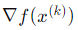

# Лабораторная №3

## Метод градиентного спуска

Алгоритм градиентного спуска — это итерационный метод оптимизации, который используется для нахождения локального
минимума функции. Этот метод особенно полезен, когда функция сложная и не имеет аналитического решения.

Устройство алгоритма:

1. Задан n-мерный вектор, точность, функция и максимальное кол-во итераций.
2. На каждом шаге k вычисляется градиент функции  в текущей точке 

